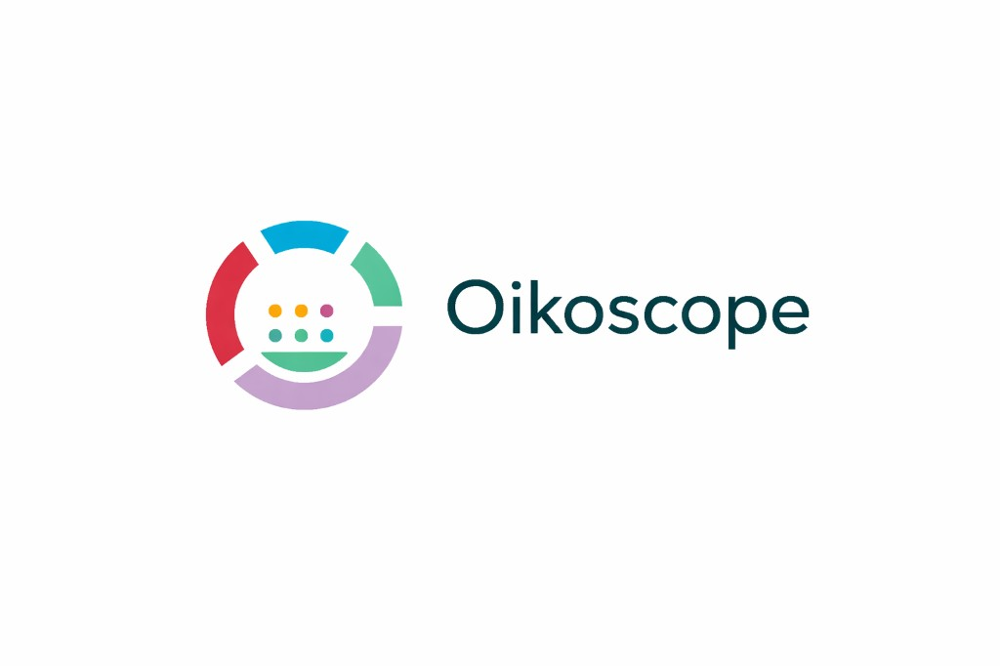

# CHAOSS Data Science Working Group

## Table of Contents

- [Introduction](#introduction)
- [CHAOSS metrics in context](#chaoss-metrics-in-context)
- [Participate](#participate)
- [Practitioner Guides](#practitioner-guides)
- [Projects](#projects)
- [Public talks, events, and writing](#public-talks-events-and-writing)
- [Contributing](#contributing)
- [Contributors](#contributors)
- [License](#license)

## Introduction

### Goal

Build a community of data scientists to collaborate on the [CHAOSS Data Science Initiative](https://chaoss.community/inside-the-chaoss-data-science-working-group/)

### Purpose

We will collaborate with data scientists and researchers to shape how we understand open source community health and make it easier for people to use CHAOSS tools, metrics, and metrics models to draw meaningful insights that they can use to improve open source project health using data science-based approaches.

### Who should join this working group?

Anyone interested in data science and data analysis can join. You don't need to be an expert or know how to perform advanced techniques, like machine learning or artificial intelligence. We welcome data scientists, data analysts, researchers and others with an interest in data.

### Background

This is a working group within the CHAOSS project to support our Data Science Initiative. If you work for a company who is interested in sponsoring some of our work, we have a [sponsorship prospectus](CHAOSS-Data-Science-Prospectus.pdf) with more details.

## CHAOSS metrics in context

CHAOSS is a [Linux Foundation project](https://chaoss.community/about/) that publishes community health metrics, models, and related software. Its **Friends of CHAOSS** page lists downstream tools and partners that adopt those artefacts in practice—including [Augur](https://github.com/chaoss/augur), [8Knot](https://github.com/oss-aspen/8knot), [OSS Compass](https://oss-compass.org/), and collaboration with the [TODO Group](https://todogroup.org/).

- **CNCF** publishes official [project health measurement guidance](https://contribute.cncf.io/maintainers/community/project-health/) aligned with dimensions CHAOSS formalises (responsiveness, contributor activity, risk, velocity, releases, inclusivity), alongside [DevStats](https://all.devstats.cncf.io/d/8/dashboards?orgId=1) dashboards.
- **GrimoireLab** is a [CHAOSS tooling stack](https://github.com/chaoss/grimoirelab) for development analytics; packages are distributed via [PyPI under the GrimoireLab organisation](https://pypi.org/org/grimoirelab/).

## Participate

### How to Join Us?

Want to join the working group? Here is a simple step by step guide on how to join:

- [Getting started as a new/first time contributor](https://chaoss.community/kb-getting-started/)
- [Agenda/Meeting-Minutes](https://docs.google.com/document/d/1jkAfGt97OGRwcdEn8hh5YyHQwoXRnOW96ikc_Aluo6M/edit)
- Join us in the #wg-data-science channel within the CHAOSS Slack Workspace.
- Learn on the [Participate](https://chaoss.community/participate/) page on the website

**Public record:** agendas and minutes for this working group are captured in the [Agenda/Meeting-Minutes](https://docs.google.com/document/d/1jkAfGt97OGRwcdEn8hh5YyHQwoXRnOW96ikc_Aluo6M/edit) document. Maintainers facilitate calls and merge changes per [CONTRIBUTING.md](CONTRIBUTING.md); that thread is the authoritative trace for governance discussions tied to this repository.

We follow the [CHAOSS Code of Conduct](https://github.com/chaoss/governance/blob/master/code-of-conduct.md)

## Practitioner Guides

The CHAOSS Data Science Working Group develops a set of [Practitioner Guides](https://chaoss.community/about-chaoss-practitioner-guides/) to help individuals understand how to interpret data about an open source project, enabling them to develop insights that can improve the project's health. They are designed for Open Source Program Offices (OSPOS), project leads, community managers, maintainers, and anyone who wants to understand project health better and take action on what they learn from their metrics.

If you are interested in [contributing to the practitioner guides](https://github.com/chaoss/wg-data-science/tree/main/practitioner-guides), you can find more details in the practitioner-guides folder here in the repo.

## Projects

We are also working on several projects using CHAOSS metrics and tools to help answer people's questions about open source projects and their unique dynamics. You can find details about these projects in the WG's [GitHub Issues](https://github.com/chaoss/wg-data-science/issues?q=is%3Aissue+is%3Aopen+label%3Aproject).

### Oikoscope

  

**Oikoscope** provides structured, reproducible views of open source foundation and project health, aligned with CHAOSS metrics. Source, data, and documentation live in the [`oikoscope/`](oikoscope/) directory.

**Canonical location (today):** [`github.com/chaoss/wg-data-science/tree/main/oikoscope`](https://github.com/chaoss/wg-data-science/tree/main/oikoscope). **Intended standalone remote:** [`github.com/chaoss/oikoscope`](https://github.com/chaoss/oikoscope) — follow [`oikoscope/docs/standalone-repository.md`](oikoscope/docs/standalone-repository.md) when publishing; then update package metadata and this README. Dataset updates belong in **`oikoscope/data/raw/`** only.

**What exists now:** validated JSON Schema for the Apache corpus, a validation CLI (`oikoscope-validate`), **47** hand-curated Apache project records in [`oikoscope/data/raw/apache.json`](oikoscope/data/raw/apache.json) (see [`oikoscope/docs/dataset-status.md`](oikoscope/docs/dataset-status.md)), research and methodology docs under [`oikoscope/docs/`](oikoscope/docs/), and EU CRA context in [`oikoscope/docs/cra-eu-relevance.md`](oikoscope/docs/cra-eu-relevance.md). CI on this monorepo runs `oikoscope-validate` when `oikoscope/**` changes.

**Verifiable outputs:**

- Apache dataset and schema on `main`: [`apache-dataset.schema.json`](https://github.com/chaoss/wg-data-science/blob/main/oikoscope/schemas/apache-dataset.schema.json) · [`apache.json`](https://github.com/chaoss/wg-data-science/blob/main/oikoscope/data/raw/apache.json)
- Working group meeting notes: [Agenda/Meeting-Minutes](https://docs.google.com/document/d/1jkAfGt97OGRwcdEn8hh5YyHQwoXRnOW96ikc_Aluo6M/edit)
- Example merged PR history for a listed maintainer: [GitHub search — `is:merged` by `@E-STAT`](https://github.com/chaoss/wg-data-science/pulls?q=is%3Apr+is%3Amerged+author%3AE-STAT)

## Public talks, events, and writing

- [CHAOSS Data Science Hackathon (June 2025)](https://chaoss.community/chaoss-data-science-hackathon-2025/) — co-located with Open Source Summit NA / CHAOSScon ([local logistics notes](events/hackathon-june-2025.md)).
- [Practitioner guides](practitioner-guides/) in this repository — CHAOSS-aligned interpretation guidance for metrics consumers.

_Add FOSDEM talks, CHAOSS blog posts, or other public artefacts via pull request to keep this list current._

## Contributing

See the [CONTRIBUTING.md](CONTRIBUTING.md) for more info.

## Contributors

### Chairs

Current Chairs:

- [Dawn Foster](https://github.com/geekygirldawn)
- [Cali Dolfi](https://github.com/cdolfi)
- [Sal Kimmich](https://github.com/Salkimmich)

Previous Chairs:
- [Chan Voong](https://github.com/voongc)

### Maintainers

- [Ernest Owojori](https://github.com/E-STAT)

### Amazing CHAOSS Project Contributors

Link to the [contributors](https://chaoss.community/metrics/#user-content-chaoss-contributors-include) listed on the website.

## License

See [LICENSE](LICENSE) file.

Copyright © CHAOSS, a Linux Foundation Project
